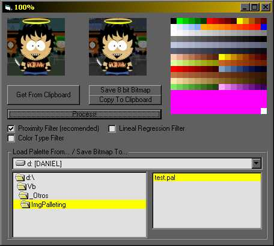



## Pallete Imaging

### Description

This program transforms the colors of a picture you paste on it according to a 256 color pallete file (.PAL) you assign, it's very helpful on Pallete using games and you can save it as an 8 bit bitmap, SEE SNAPSHOT
 
### More Info
 
You must paste any image where the programs says

You must assign a 256 color .PAL file

The image the user pastes with the nearest colors the pallete can give

It's a little slow

The "not recommended" filters are not so reliable, as the Proximity Filter

             |
---                |---
**Submitted On**   |2004-01-05 12:25:08
**By**             |[Gacho Man](https://github.com/Planet-Source-Code/PSCIndex/blob/master/ByAuthor/gacho-man.md)
**Level**          |Intermediate
**User Rating**    |4.3 (13 globes from 3 users)
**Compatibility**  |VB 6\.0
**Category**       |[Graphics](https://github.com/Planet-Source-Code/PSCIndex/blob/master/ByCategory/graphics__1-46.md)
**World**          |[Visual Basic](https://github.com/Planet-Source-Code/PSCIndex/blob/master/ByWorld/visual-basic.md)
**Archive File**   |[Pallete\_Im169067152004\.zip](https://github.com/Planet-Source-Code/gacho-man-pallete-imaging__1-50798/archive/master.zip)

